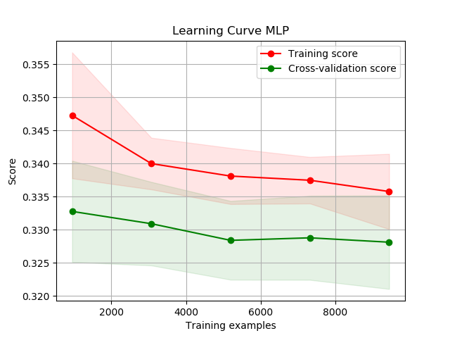

# This is an in-course project

Unfortunately, I cannot upload the dataset. These are just code demos.

## Introduction:

In this project, my objective is using Keras to implement one Classification pipeline. One normal image pipeline should include many procedures. For Example, Selection, Pre-processing, Transformation, Data Mining and result evaluation. In this project, All the data are provided by ECS original project image data, which means I have not enriched the data set by myself. I focus on pre-processing, Transformation, and so on. All the project requiring tools are same as the Template code, which include Tensorflow-Keras, SK-Learn, and Numpy are the majority tools.

## Problem investigation:
I must explain the exploratory data analysis (EDA) in this project. 

1.	Data Understanding:
In this project, all the data are the image, and I do not use other source data, so that all the data are given by the project. For the image data, which could show as a 3-channel RGB graph, and each channel could regard as a matrix. The image could represent as a width * length * 3 shape of array, and each element in the matrix represent the pixel of the image. All the RGB channel¡¯s pixel are the integer number from 0 to 255.

There are 6000 images totally, and using all of data as training set is not sensibly. The image data set has been already extracted 1500 data for testing , and I have remainder 4500 data for training. There are 3 categories of the data set, which means there are 3 classes, and this problem belongs to object classification.

2.	Preprocessing: 
The objective of the preprocessing is improving the CNN model performance rather than random using it. I plan to using row pixels rather than pixel statistics for the CNN, because CNN will create some feature maps for the feature extraction and there are some problems need to handle of the images. For the MLP which I use pixel statistic rather than raw pixels.

I go through of the data set at first, then I found there are some object are not belonging to the categories as the main feature of the images. For Example, for the strawberry there exist some images are the strawberry cakes, but only have some few strawberry slices on the images, so that the main feature of these images is not the class object. There are some images of these class objects have a large margin, the margin of the image will reduce the training performance. 

#### Template matching:
For reduce the problems that I have mentioned above the first idea emerge in my mind is using Template Matching algorithm for feature extraction which means get the majority class objects from the images and block other pixels. The Template Matching means find template contains the objects and uses raw image data as feature vector to find the specific objects with in the images.

#### The templet matching procedures:
1.	Set the template objects.
2.	Sweep the template across images pixel by pixel.
3.	Measure the operation by Euclidean Distance.
4.	Set a threshold on the measure to determine when the template has match.
5.	Report the center of the objects found.

The issues that I find here is there are so many variations across the data set. As we can conclude here, these tomatos with different shape, color and size, so that the template object should be a set contain many objects and have to find many thresholds.

## Data Augmentation:
Due to the time limitation and I plan to build a base-line model first then I using another simply approach for the basic model that is Data Augmentation, and if people have much consider then could do Template matching in the futher design.

1.	Resize the image to 300*300
2.	Clop the image at the central area ( remove margin)
3.	Using wrapper approach to find the better central area. ( 150 * 150, 200 * 200, 240 * 240, 250* 250)

When I finishing crop the images into 240 * 240, and I rotate the image in 90 degree and 270 degree for enrich the data set.

#### Process on the labels:
Because the data set labels are tomato, cherry and strawberry 3 classes, which we convert it into categories data such as 0, 1, 2 might not sensible. The Neural Network might not generalize between different categories. Using Binary representation in here rather than categories. For instance, (1, 0, 0) for class tomato, (0, 1, 0) for class cherry, and (0, 0, 1) for class strawberry.

For the basic MLP model, using raw pixels are input vector will make the training take a long time. I using pixel statistics rather than the raw pixels only for the MLP. For each clopped and rotated image, I statistic the mean and standard deviation for each channel. So, there are 6 features at totally.

## Methodology:
The inspiration of my CNN come from LetNet:
Firstly, I must explain my CNN structure.
1. The input layer is a 64*64*3 matrix.

2. The first hidden layer is feature selection layer, contain 32 sub-sample matrices which the convolution kernel is 3*3. My idea is split the images into 32 parts, although, I have cropped the image. There still have some margin or useless things, then I want to find more relative things to the object class. This means there are 32 feature maps. For count the feature maps size, the input matrix after padding is 18 * 18, and the filter size is 3*3 and shift pixel by pixel. The feature map size should be a row=col=(18 - 3)/1+1=16*16 matrix. The total parameters are feature maps*((weight+ bias)*(# of nodes ))=32*((3*3+1)*(16*16 ))=81920

3. The second hidden layer is also a feature selection layer, contain 64 sub-sample matrices which the convolution kernel is 3*3.  Similar idea as above layer, I want to get more specific feature so that I double the feature map size. The feature map size should be a row=col=(16 - 3)/1+1=14*14 matrix. The total parameters are feature maps*((weight+ bias)*(# of nodes ))=64*((3*3+1)*(14*14 ))=125440

4. The third hidden layer is max pooling layer, where the pooling matrix kernel is 2*2.  Because there are too many features as above. I compress the image while keeping the key features, and not change the object, so that the max pooling algorithm is a good choice.

5. The forth hidden layer is dropout layer with 25%, which means each time before updating the weights, each neuron has 25% to dropout. The reason that I want to using dropout here that training a network is hard, such as vanishing gradient problem. Smaller gradients lead to learn very slow and almost random, compare with Larger gradients learn very fast and might be already converge. Because dropout change the network structure then we could train a set of different networks, However, we test by averaging the output of all trained networks.

6. The fifth hidden layer is fully connected layer with the L2 regularisation which I will explain later.

7. The sixth hidden layer is dropout layer with 50% rate.

8. The final hidden layer is the activation layer with softmax function to find the probability of 3 categories for the input images belongs to.

## Result Discussions:
### MLP:
### The difference between MLP and CNN are:

I using pixel statistic which count mean and standard deviation for each channel of the image rather than the raw pixels. MLP use a structure as 9 - 12 - 24 -12 - 1 and MLP using SGD with momentum = 0.3 and learning rate = 0.04.

For the test, MLP is a basic line of classification model which test on 2700 test set. CNN test on the template 15 unseen data and also test on the 2700 test set, however the 15 unseen data is what I want to reflect the model performance.

MLP achieve best at 0.44 at 2700 and CNN achieve 0.66 on 15 unseen data, the learning curves show as following:

### Conclusions and future work:
In conclusion, CNN could receive better classification performance than MLP, I think it is because of the feature map which select by the convolutions. 
However, it needs pre-train the model first then could using it as classifier and it needs too much time than MLP. 

#### There are many aspects that people could do in the post development:
1.	Change the convolution kernel size and number of pixel shift at each time such as 5 * 5 and shit 2 pixels. 

2.	As I have talked in the second part, Try Template Matching to preprocess before training. I believe a better training set will reflect a better performance than before.

3.	Using Genetic Programming to automatically evolve an architecture or Using PSO to find the best weights.

### Results: 

